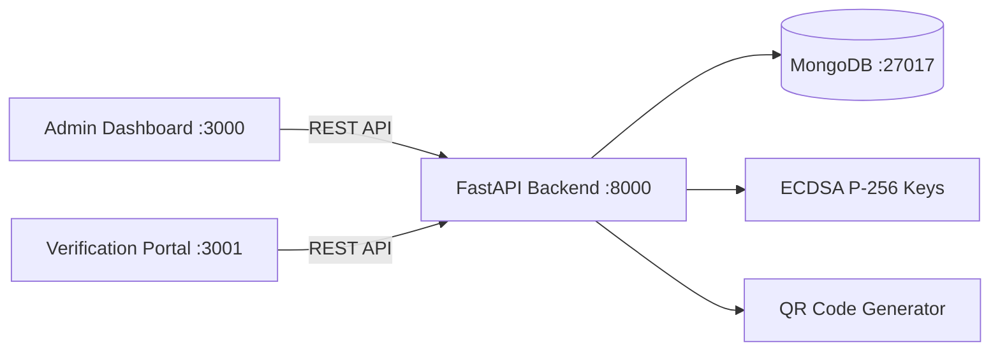

# CertShield

Digital Certificate Verification Microservice — issue tamper-proof certificates with ECDSA P-256 signatures, generate QR codes for instant verification, and store everything in MongoDB.

```
Certificate Data --> ECDSA Sign --> QR Code --> MongoDB
Recruiter scans QR --> Verification API --> VALID / REVOKED / TAMPERED / NOT_FOUND
```

## Architecture



| Component | Tech | Port |
|-----------|------|------|
| Backend API | Python 3.12 + FastAPI | 8000 |
| Admin Dashboard | React 18 + Vite | 3000 |
| Verification Portal | React 18 + Vite | 3001 |
| Database | MongoDB 7+ | 27017 |

## Prerequisites

- **Python 3.12+**
- **Node.js 18+** and **npm**
- **MongoDB 7+** running locally or a connection URI

### Install MongoDB (macOS)

```bash
brew tap mongodb/brew
brew install mongodb-community@7.0
brew services start mongodb-community@7.0
```

Verify it's running:

```bash
mongosh --eval "db.runCommand({ ping: 1 })"
```

### Install MongoDB (Ubuntu/Debian)

```bash
# Import MongoDB public GPG key and add repo
sudo apt-get install -y gnupg curl
curl -fsSL https://www.mongodb.org/static/pgp/server-7.0.asc | sudo gpg -o /usr/share/keyrings/mongodb-server-7.0.gpg --dearmor
echo "deb [ signed-by=/usr/share/keyrings/mongodb-server-7.0.gpg ] https://repo.mongodb.org/apt/ubuntu jammy/mongodb-org/7.0 multiverse" | sudo tee /etc/apt/sources.list.d/mongodb-org-7.0.list
sudo apt-get update
sudo apt-get install -y mongodb-org
sudo systemctl start mongod
sudo systemctl enable mongod
```

### Install MongoDB (Windows)

Download the MSI installer from the [MongoDB Download Center](https://www.mongodb.com/try/download/community) and follow the installation wizard. Ensure "Install MongoDB as a Service" is checked.

## Project Setup

### 1. Clone the repository

```bash
git clone https://github.com/ZenVInnovations/ZENCSE010.git cert-shield
cd cert-shield
```

### 2. Backend Setup

```bash
cd backend

# Create and activate virtual environment
python3 -m venv .venv
source .venv/bin/activate        # macOS/Linux
# .venv\Scripts\activate         # Windows

# Install dependencies
pip install -r requirements.txt
```

### 3. Environment Configuration

```bash
# Copy the example env file (from inside backend/)
cp .env.example .env
```

Edit `backend/.env` with your values:

```env
# MongoDB
MONGODB_URL=mongodb://localhost:27017
MONGODB_DB_NAME=certshield

# API Key -- generate a strong random key for admin endpoints
API_KEY=your-secret-api-key-here

# Verification portal URL (embedded in QR codes)
VERIFY_BASE_URL=http://localhost:3001/v

# Institution name (shown on verification page)
INSTITUTION_NAME=Your Institution Name

# ECDSA Key paths (relative to backend/)
PRIVATE_KEY_PATH=keys/private_key.pem
PUBLIC_KEY_PATH=keys/public_key.pem
KEY_ID=key-2026-01

# App settings
APP_ENV=development
APP_HOST=0.0.0.0
APP_PORT=8000
```

Generate a strong API key:

```bash
python3 -c "import secrets; print(secrets.token_urlsafe(32))"
```

### 4. Generate ECDSA Key Pair

This must be done **once** before starting the backend. The key pair is used to sign and verify certificates.

```bash
# From backend/
python generate_keys.py
```

This creates:
- `keys/private_key.pem` -- used to sign certificates (keep secret, never commit)
- `keys/public_key.pem` -- used to verify signatures

> **Warning:** Regenerating keys invalidates all previously signed certificates. Back up your keys in production.

### 5. Frontend Setup

**Admin Dashboard** (port 3000):

```bash
cd frontend-admin
npm install
```

**Verification Portal** (port 3001):

```bash
cd frontend-portal
npm install
```

Optionally create `.env` files for each frontend to override the API URL:

```bash
# frontend-admin/.env
VITE_API_URL=http://localhost:8000

# frontend-portal/.env
VITE_API_URL=http://localhost:8000
```

## Running the Application

You need **three terminals** (plus MongoDB running in the background):

**Terminal 1 -- Backend API:**

```bash
cd backend
source .venv/bin/activate
uvicorn app.main:app --reload --host 0.0.0.0 --port 8000
```

**Terminal 2 -- Admin Dashboard:**

```bash
cd frontend-admin
npm run dev
```

**Terminal 3 -- Verification Portal:**

```bash
cd frontend-portal
npm run dev
```

### Access Points

| Service | URL |
|---------|-----|
| Backend API | http://localhost:8000 |
| API Docs (Swagger) | http://localhost:8000/docs |
| Admin Dashboard | http://localhost:3000 |
| Verification Portal | http://localhost:3001 |

## API Endpoints

### Certificate Management (requires `X-API-Key` header)

| Method | Endpoint | Description |
|--------|----------|-------------|
| POST | `/api/certificates` | Issue a new certificate |
| GET | `/api/certificates` | List all certificates |
| GET | `/api/certificates/{id}` | Get certificate by ID |
| PATCH | `/api/certificates/{id}/revoke` | Revoke a certificate |

### Verification (Public -- rate limited to 60 req/min per IP)

| Method | Endpoint | Description |
|--------|----------|-------------|
| GET | `/api/verify/{certificate_id}` | Verify a certificate |

### Admin (requires `X-API-Key` header)

| Method | Endpoint | Description |
|--------|----------|-------------|
| GET | `/api/admin/stats` | Dashboard statistics |

### Example: Issue a Certificate

```bash
curl -X POST http://localhost:8000/api/certificates \
  -H "Content-Type: application/json" \
  -H "X-API-Key: your-secret-api-key-here" \
  -d '{
    "recipient": {
      "name": "John Doe",
      "email": "john@example.com"
    },
    "course": {
      "name": "Full Stack Development",
      "description": "30-day intensive bootcamp"
    },
    "issued_by": "Prof. Smith"
  }'
```

### Example: Verify a Certificate

```bash
curl http://localhost:8000/api/verify/CERT-XXXXXXXX
```

Response:

```json
{
  "status": "VALID",
  "certificate_id": "CERT-XXXXXXXX",
  "recipient_name": "John Doe",
  "course_name": "Full Stack Development",
  "issued_at": "2026-03-05T10:00:00Z",
  "institution": "Your Institution Name"
}
```

Possible status values: `VALID`, `REVOKED`, `TAMPERED`, `NOT_FOUND`

## How It Works

1. **Admin issues a certificate** via the dashboard or API
2. Certificate data is **canonicalized** (sorted JSON) and **SHA-256 hashed**
3. The hash is **signed with ECDSA P-256** using the private key
4. A **QR code** is generated containing the verification URL (`/v/{cert_id}`)
5. Certificate + signature + QR code are **stored in MongoDB**
6. **Recruiter scans QR** --> hits the verification portal
7. Portal calls the API which **recomputes the hash** and **verifies the signature** with the public key
8. Returns: **VALID** | **REVOKED** | **TAMPERED** | **NOT_FOUND**

## Project Structure

```
cert-shield/
├── backend/
│   ├── app/
│   │   ├── config.py                  # Settings (Pydantic-settings, loads .env)
│   │   ├── database.py                # MongoDB connection (Motor async driver)
│   │   ├── main.py                    # FastAPI app entry point
│   │   ├── models/
│   │   │   ├── certificate.py         # Certificate document model
│   │   │   └── verification_log.py    # Verification log model
│   │   ├── schemas/
│   │   │   ├── certificate.py         # Request/response Pydantic schemas
│   │   │   └── verification.py        # Verification schemas
│   │   ├── services/
│   │   │   ├── signature_service.py   # ECDSA sign & verify
│   │   │   ├── qr_service.py         # QR code generation
│   │   │   ├── certificate_service.py # Certificate CRUD logic
│   │   │   └── verification_service.py# Verification logic
│   │   ├── routers/
│   │   │   ├── certificates.py        # /api/certificates routes
│   │   │   ├── verification.py        # /api/verify routes
│   │   │   └── admin.py              # /api/admin routes
│   │   ├── middleware/
│   │   │   ├── api_key_auth.py        # X-API-Key authentication
│   │   │   └── rate_limiter.py        # slowapi rate limiting
│   │   └── exceptions/
│   │       └── handlers.py            # Global exception handlers
│   ├── keys/                          # ECDSA key pair (gitignored)
│   ├── generate_keys.py               # One-time key generation script
│   ├── requirements.txt
│   ├── Dockerfile
│   └── .env.example
├── frontend-admin/                    # React admin dashboard (port 3000)
│   ├── src/
│   │   ├── pages/
│   │   │   ├── Dashboard.jsx
│   │   │   ├── IssueCertificate.jsx
│   │   │   ├── CertificateList.jsx
│   │   │   └── CertificateDetail.jsx
│   │   ├── api/client.js             # Axios instance with API key
│   │   ├── App.jsx
│   │   └── main.jsx
│   └── package.json
├── frontend-portal/                   # React verification portal (port 3001)
│   ├── src/
│   │   ├── pages/
│   │   │   ├── VerifyPage.jsx
│   │   │   └── VerificationResult.jsx
│   │   ├── api/client.js             # Axios instance
│   │   ├── App.jsx
│   │   └── main.jsx
│   └── package.json
├── SPRINTS.md                         # 4 sprints, 35 user stories
├── .gitignore
└── README.md
```

## Docker (Optional)

### Backend only

```bash
cd backend
docker build -t certshield-api .
docker run -p 8000:8000 --env-file .env certshield-api
```

If MongoDB is running on the host machine, update `.env`:

```env
MONGODB_URL=mongodb://host.docker.internal:27017
```

## MongoDB Collections

The application uses two collections (indexes are created automatically on startup):

### `certificates`

| Index | Fields | Type |
|-------|--------|------|
| idx_certificate_id | `certificate_id` | Unique |
| idx_data_hash | `signature.data_hash` | Unique |
| idx_recipient_email | `recipient.email` | Regular |
| idx_status_expiry | `status` + `expires_at` | Compound |

### `verification_logs`

| Index | Fields | Type |
|-------|--------|------|
| idx_log_cert_id | `certificate_id` | Regular |
| idx_log_verified_at | `verified_at` | Regular |

## Development Notes

- `config.py` and `database.py` are **fully implemented** -- all other backend files are **student stubs with TODO instructions**
- Each stub contains detailed hints, expected function signatures, and import suggestions
- Refer to [SPRINTS.md](./SPRINTS.md) for the complete sprint plan and 35 user stories with acceptance criteria
- API key auth uses `secrets.compare_digest` for timing-safe comparison
- Rate limiting: 60 requests/minute per IP on the public verify endpoint
- MongoDB indexes are created automatically on startup via the FastAPI lifespan handler
- Both frontends proxy `/api` requests to `http://localhost:8000` via Vite config

## Tech Stack

| Layer | Technology |
|-------|-----------|
| Backend Framework | FastAPI 0.111 |
| Async MongoDB Driver | Motor 3.4 |
| Cryptography | ECDSA P-256 (cryptography 42.x) |
| QR Code | qrcode 7.4 + Pillow 10.3 |
| Rate Limiting | slowapi 0.1.9 |
| Validation | Pydantic v2.7 |
| Frontend | React 18.3 + Vite 5.3 |
| HTTP Client | Axios 1.7 |
| Routing | React Router v6.23 |
